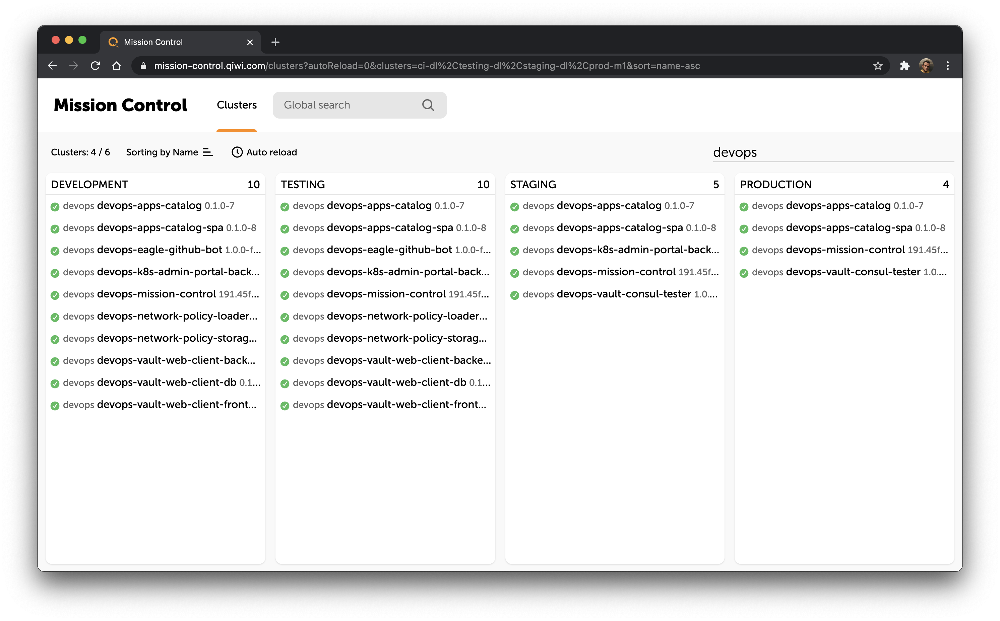

# devops-mission-control #

One dashboard to rule them all.



* View all deployments in several k8s clusters on the one page
* Look for deployment across all k8s clusters
* View deployment details, like as status, IP, history of releases and list of pods

#### Quick start ####

```shell script
docker run -p 8080:8080 -v ~/.kube:/home/mission-control/.kube mission-control
```

The application will be accessible at http://localhost:8080. 
In-docker execution uses example configuration from src/main/resources by default. 
You can override embed configuration: `-v config:/etc/mission-control/override`.

#### Configuration ####

##### Clusters #####
There are two options how to configure clusters:

a) Importing clusters and security options from the configuration file for kubectl
(~/.kube/config). It's appropriate for the local or development environment.
```yaml
mission-control:
  clusters-source:
    type: kubeconfig
    kubeconfig:
      path: "~/.kube/config"
```

b) Defining clusters and tokens in the application's configuration file. 
It's more appropriate to use in production.
```yaml
mission-control:
  clusters:
    - name: testing
      displayName: "TESTING A"
      host: "https://kubernetes.testing.example.com:6443"
      dc: "datacenter-name"
      tokenName: "test"
    - name: prod
      displayName: "PROD A"
      host: "https://kubernetes.production.example.com:6443"
      dc: "datacenter-name"
      tokenName: "prod"

  tokens:
    - name: test
      token: ""
    - name: prod
      token: ""
```